<!-- README.md is generated from README.Rmd. Please edit that file -->

# {imdvizzer}

{imdvizzer} is designed to visualise England’s [Index of Multiple
Deprivation
(IMD)](https://en.wikipedia.org/wiki/Multiple_deprivation_index) data in
as many ways (or as few) as needed.

The main data source is the [2019 IMD data from the Ministry of Housing,
Communities & Local
Government](https://www.gov.uk/government/statistics/english-indices-of-deprivation-2019).
This data was published with a [suite of additional mapping
resources](https://www.gov.uk/guidance/english-indices-of-deprivation-2019-mapping-resources).
In particular this [zoomable
map](https://dclgapps.communities.gov.uk/imd/iod_index.html) may be of
interest.

For convenience and ease of extension {imdvizzer} uses the
[{geographr}](https://github.com/humaniverse/geographr) package for map
geometries and area lookup files, and the
[{IMD}](https://github.com/humaniverse/IMD) package for IMD data.

## Usage

The first function implemented plots maps of IMD data for each English
Integrated Care Board (ICB). It can be used as follows:

``` r
library(imdvizzer)

map_imd_icb("NHS Nottingham and Nottinghamshire Integrated Care Board")
```


## All English ICBs

This is the 2019 IMD data plotted for every ICB. The individual regions
plotted are [Lower Layer Super Output Areas
(LSOAs)](https://en.wikipedia.org/wiki/GSS_coding_system#Neighbourhood_Statistics_Geography),
which are consistent small geographical regions with populations of on
average 1500 people. Note that the x and y axis scales of these
individual maps are not intended to be consistent. The colour scales are
consistent across the maps.

#### NHS Bath and North East Somerset, Swindon and Wiltshire Integrated Care Board


------------------------------------------------------------------------

#### NHS Bedfordshire, Luton and Milton Keynes Integrated Care Board

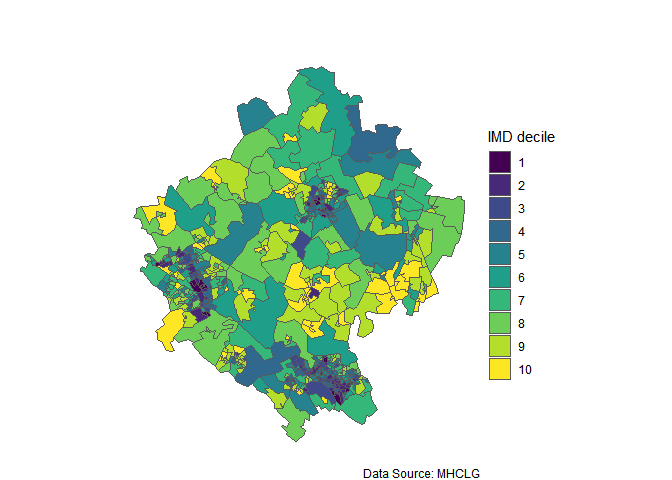

------------------------------------------------------------------------

#### NHS Birmingham and Solihull Integrated Care Board

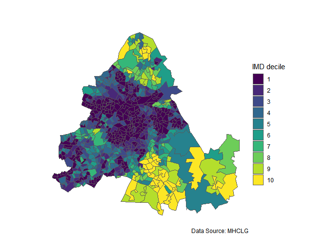

------------------------------------------------------------------------

#### NHS Black Country Integrated Care Board

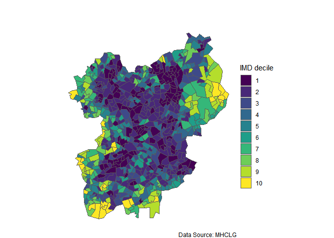

------------------------------------------------------------------------

#### NHS Bristol, North Somerset and South Gloucestershire Integrated Care Board


------------------------------------------------------------------------

#### NHS Buckinghamshire, Oxfordshire and Berkshire West Integrated Care Board

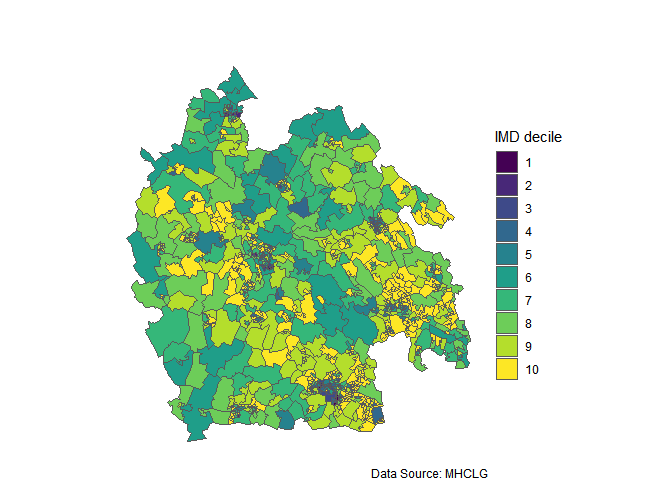

------------------------------------------------------------------------

#### NHS Cambridgeshire and Peterborough Integrated Care Board

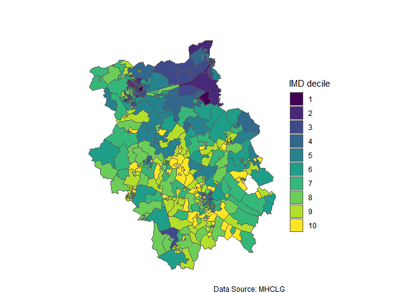

------------------------------------------------------------------------

#### NHS Cheshire and Merseyside Integrated Care Board

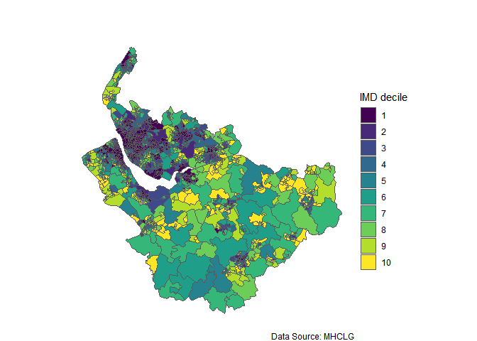

------------------------------------------------------------------------

#### NHS Cornwall and the Isles of Scilly Integrated Care Board

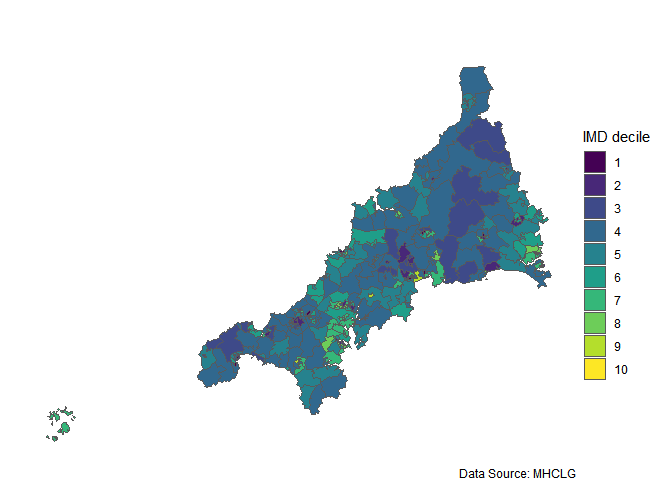

------------------------------------------------------------------------

#### NHS Coventry and Warwickshire Integrated Care Board

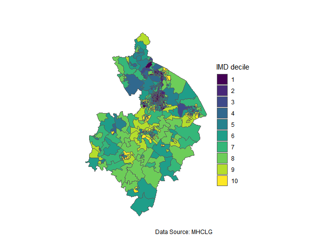

------------------------------------------------------------------------

#### NHS Derby and Derbyshire Integrated Care Board

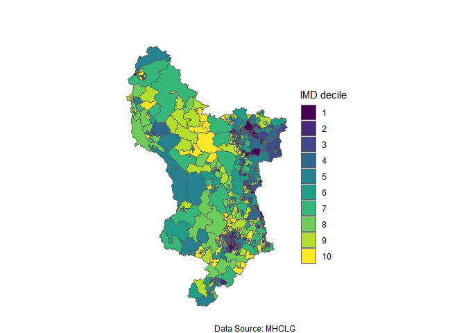

------------------------------------------------------------------------

#### NHS Devon Integrated Care Board


------------------------------------------------------------------------

#### NHS Dorset Integrated Care Board


------------------------------------------------------------------------

#### NHS Frimley Integrated Care Board


------------------------------------------------------------------------

#### NHS Gloucestershire Integrated Care Board

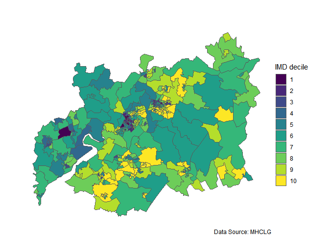

------------------------------------------------------------------------

#### NHS Greater Manchester Integrated Care Board


------------------------------------------------------------------------

#### NHS Hampshire and Isle of Wight Integrated Care Board

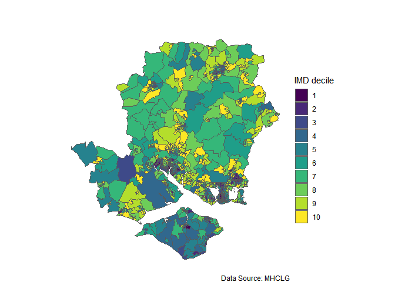

------------------------------------------------------------------------

#### NHS Herefordshire and Worcestershire Integrated Care Board

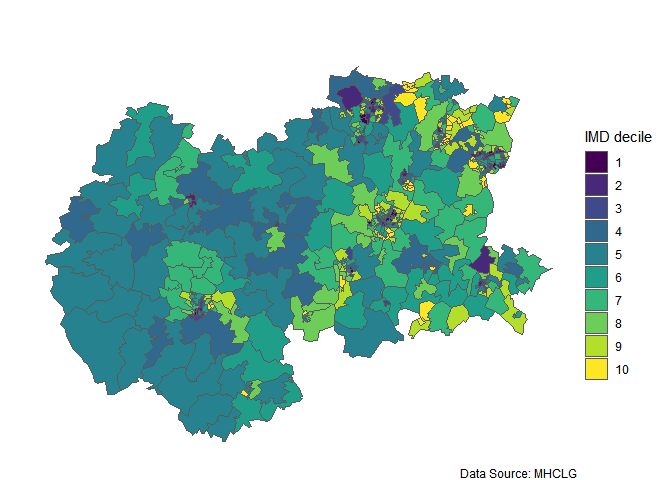

------------------------------------------------------------------------

#### NHS Hertfordshire and West Essex Integrated Care Board

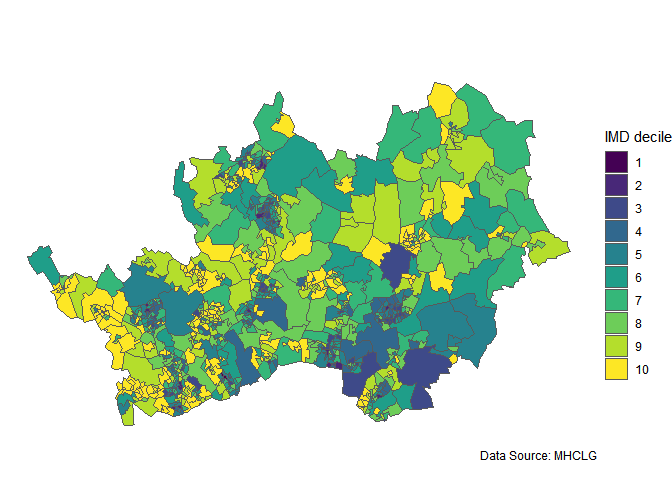

------------------------------------------------------------------------

#### NHS Humber and North Yorkshire Integrated Care Board


------------------------------------------------------------------------

#### NHS Kent and Medway Integrated Care Board


------------------------------------------------------------------------

#### NHS Lancashire and South Cumbria Integrated Care Board

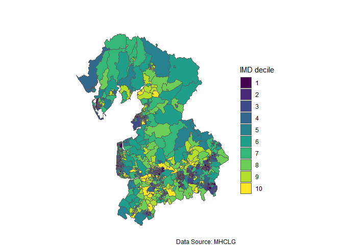

------------------------------------------------------------------------

#### NHS Leicester, Leicestershire and Rutland Integrated Care Board


------------------------------------------------------------------------

#### NHS Lincolnshire Integrated Care Board


------------------------------------------------------------------------

#### NHS Mid and South Essex Integrated Care Board


------------------------------------------------------------------------

#### NHS Norfolk and Waveney Integrated Care Board


------------------------------------------------------------------------

#### NHS North Central London Integrated Care Board

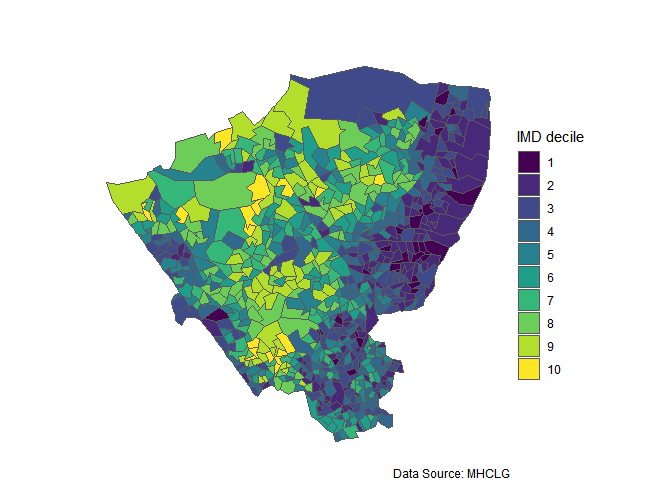

------------------------------------------------------------------------

#### NHS North East London Integrated Care Board

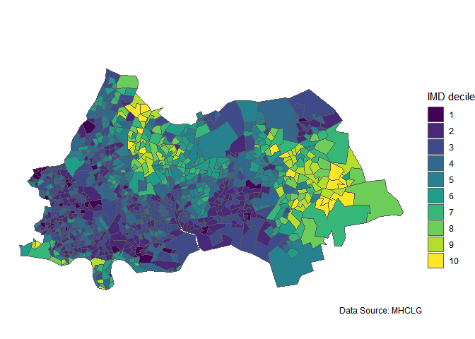

------------------------------------------------------------------------

#### NHS North East and North Cumbria Integrated Care Board

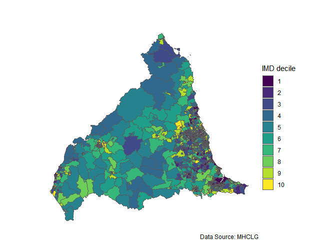

------------------------------------------------------------------------

#### NHS North West London Integrated Care Board

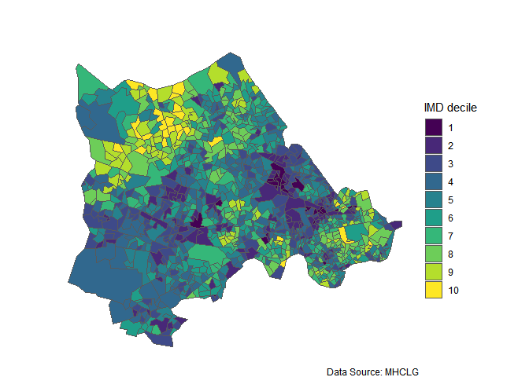

------------------------------------------------------------------------

#### NHS Northamptonshire Integrated Care Board


------------------------------------------------------------------------

#### NHS Nottingham and Nottinghamshire Integrated Care Board


------------------------------------------------------------------------

#### NHS Shropshire, Telford and Wrekin Integrated Care Board

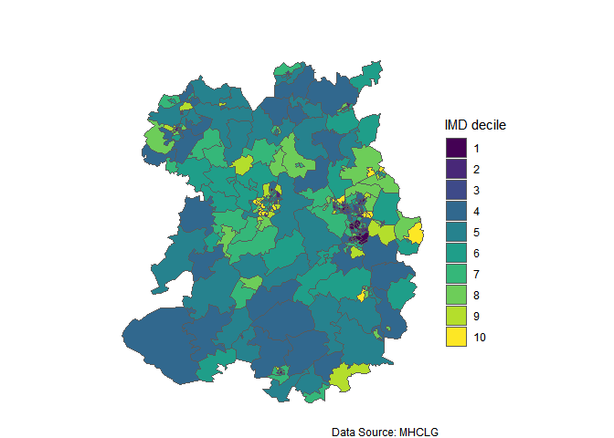

------------------------------------------------------------------------

#### NHS Somerset Integrated Care Board

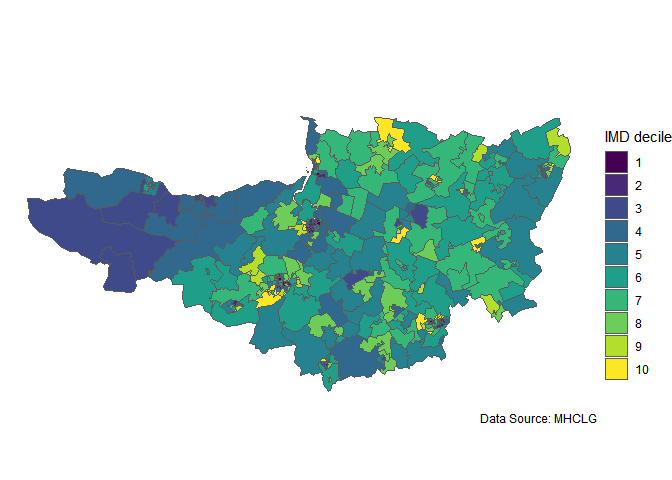

------------------------------------------------------------------------

#### NHS South East London Integrated Care Board

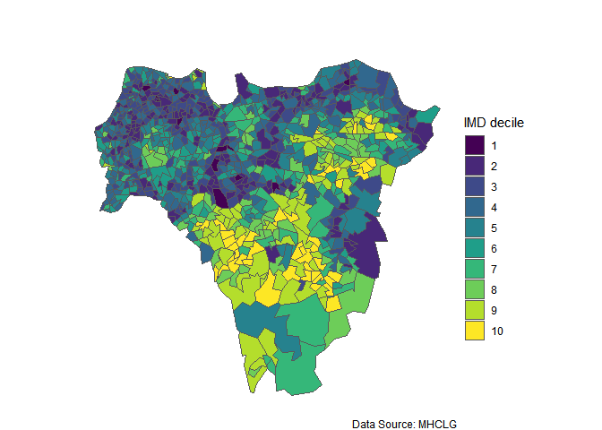

------------------------------------------------------------------------

#### NHS South West London Integrated Care Board


------------------------------------------------------------------------

#### NHS South Yorkshire Integrated Care Board


------------------------------------------------------------------------

#### NHS Staffordshire and Stoke-on-Trent Integrated Care Board


------------------------------------------------------------------------

#### NHS Suffolk and North East Essex Integrated Care Board

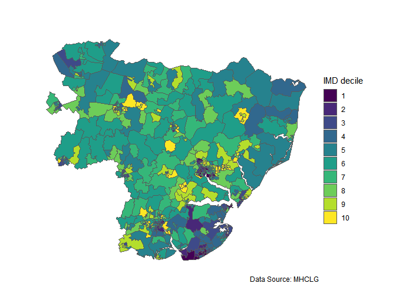

------------------------------------------------------------------------

#### NHS Surrey Heartlands Integrated Care Board

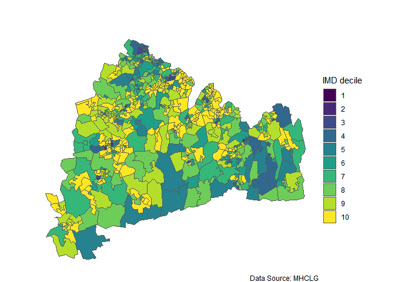

------------------------------------------------------------------------

#### NHS Sussex Integrated Care Board


------------------------------------------------------------------------

#### NHS West Yorkshire Integrated Care Board


------------------------------------------------------------------------

END
